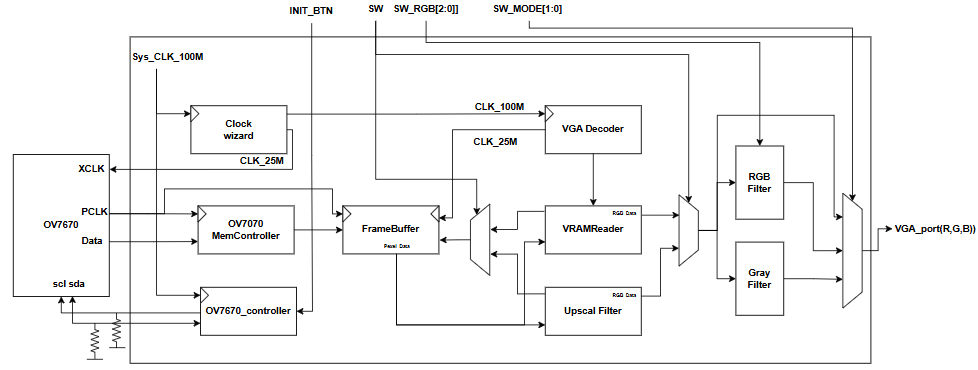
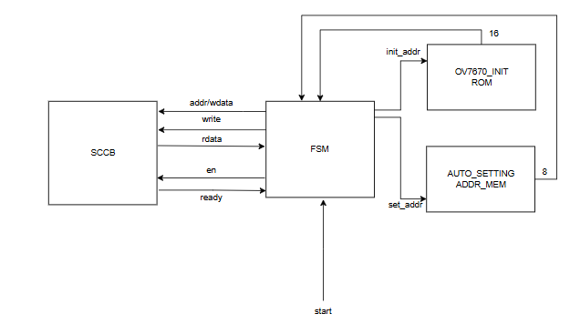

# Include_OV7670_controller

본 프로젝트는 **OV7670 카메라 센서**로부터 입력받은 QVGA 해상도의 영상을 하드웨어(FPGA) 내에서 실시간 처리하여, **VGA 포트**를 통해 모니터로 정밀 출력하는 디지털 시스템 설계 프로젝트입니다.

---

## 1. 전체 시스템 구조 (System Architecture)

본 시스템은 클럭 생성, 카메라 데이터 캡처, 프레임 버퍼 저장, 영상 처리 및 VGA 디스플레이 파이프라인이 유기적으로 연결되어 동작합니다.

### 💡 주요 기능 (Key Features)

* **기능 1: 영상 업스케일링 (Upscaling)**
    * 카메라에서 입력되는 저해상도 QVGA(320x240) 비디오 스트림을 표준 VGA(640x480 @ 60Hz) 해상도 화면에 맞게 디지털 하드웨어 필터(`Upscal Filter`)를 거쳐 확대 출력합니다.
* **기능 2: RGB 채널 선택 모드 (RGB Selection Mode)**
    * 보드 내 장착된 외부 스위치(`SW_RGB`) 조작을 통해, 실시간으로 특정 RGB 색상 채널만을 분리하거나 강조하여 화면에 표시할 수 있습니다.
* **기능 3: 그레이스케일 변환 (Grayscale Mode)**
    * 입력된 컬러 영상에 실시간 흑백 변환 알고리즘(`Gray Filter`)을 적용하여 왜곡 없이 선명한 그레이스케일 영상으로 출력합니다.

---

## 2. 상세 모듈 설계: OV7670 컨트롤러 (OV7670 Controller)

OV7670 카메라 센서가 정상적으로 화면을 출력하기 위해서는 수십 개의 내부 레지스터를 정확히 셋팅해야 합니다. 이 모듈은 전원 인가 시 카메라의 초기 설정을 직렬 통신으로 제어하는 핵심 유닛입니다.

### 🛠 내부 구성 요소 (Sub-modules)

* **FSM (Finite State Machine, 유한 상태 기계)**
    * SCCB 통신 모듈과 내부 메모리를 총괄 제어하는 메인 컨트롤 유닛(Control Unit)입니다. 시스템 시작 신호(`start`)를 받아 정해진 규칙에 따라 초기화 및 세팅 시퀀스를 순차적으로 구동합니다.
* **OV7670_INIT_ROM**
    * 카메라 센서 구동에 필수적인 기본 레지스터 주소와 셋팅 설정값(Register Address & Data)이 하드코딩 형태로 저장되어 있는 읽기 전용 메모리(ROM)입니다.
* **AUTO_SETTING_ADDR_MEM**
    * 동작 환경이나 모드 변경에 따라 유연하게 재설정(Dynamic Configuration)이 필요한 특정 레지스터들의 주소 정보가 체계적으로 담겨 있는 관리 메모리입니다.