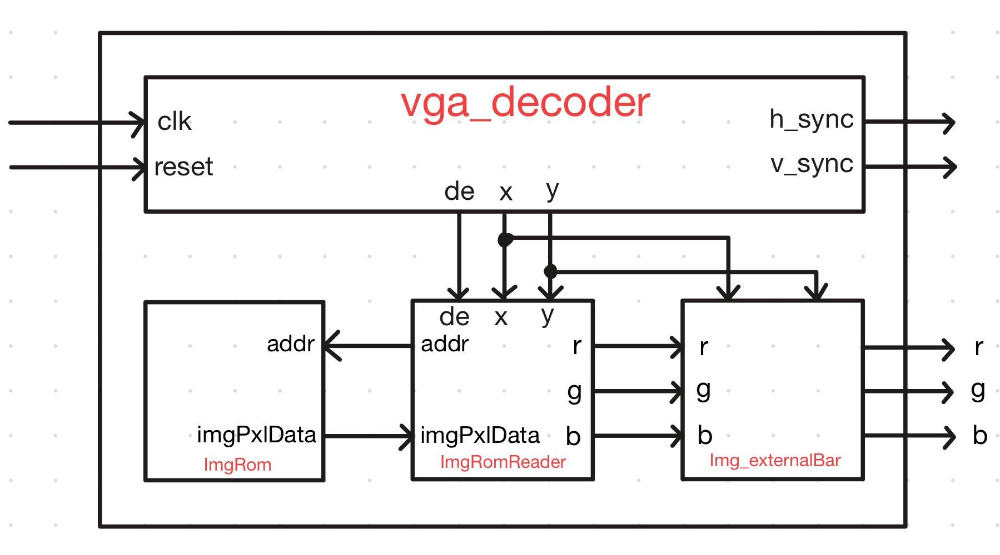

# VGA Image Pipeline (SystemVerilog)

FPGA VGA 출력단에서 ROM 이미지에 바운딩 박스/구분선을 오버레이하는 모듈 구현 기록.

---

## Day 1 — 106x120 이미지 바운딩 박스 & 구분선

### 오늘 한 일

`ImgROM`에 저장된 106x120 이미지(Marron.mem) 위에 테두리와 구분선을 오버레이하는 기능을 구현했다. 레이아웃은 상단에 메인 이미지, 하단에 3분할 썸네일이 오는 구조로, 각 영역 경계에 1px 두께의 검은 선을 그어 구분한다.

처음에는 색이 제대로 들어갔는지 눈으로 바로 확인하기 어려워서, 테두리/구분선 색을 검정 대신 빨간색으로 임시 출력해 위치를 검증했다. 이 과정에서 구분선 좌표 계산에 106x120 영역 제한이 빠져 있어 화면 전체로 선이 뻗어나가는 버그를 발견했고, 표시 영역(`display_area`) 조건을 추가해 해당 영역 안에서만 선이 그려지도록 고쳤다. 또한 이미지 가장자리를 감싸는 외곽 테두리(프레임) 로직도 추가했다.

이미지 데이터를 저장하는 `ImgROM`은 원래 조합 로직으로 비동기 read를 하고 있었는데, 이 방식으로는 합성 시 BRAM(블록 메모리)으로 잡히지 않을 수 있어 클럭 기준 레지스터 출력으로 바꿨다. 아울러 `de`(display enable) 신호가 로직에 반영되지 않아 블랭킹 구간에서도 값이 출력될 수 있던 부분도 함께 수정했다.

### 모듈 구조

VGA 타이밍 생성기가 `de/x/y`를 만들면, `ImgRomReader`가 그 좌표로 `ImgROM`에서 픽셀을 읽어와 RGB로 변환하고, 마지막으로 `Img_externalBar`가 같은 좌표를 보고 테두리/구분선을 덧씌워 최종 출력을 만든다.

### 레이아웃 사양

- 전체 이미지: 106(W) x 120(H)
- 상단 메인 영역: y = 0 ~ 79 (80px, 전체 폭)
- 가로 구분선: y = 80 (1px)
- 하단 3분할 영역: y = 81 ~ 119
  - 컬럼1: x = 0 ~ 34 (35px) / 세로 구분선 1: x = 35
  - 컬럼2: x = 36 ~ 69 (34px) / 세로 구분선 2: x = 70
  - 컬럼3: x = 71 ~ 105 (35px)
- 검산: 35+1+34+1+35 = 106 ✓ / 80+1+39 = 120 ✓

### 트러블슈팅

| 이슈 | 원인 | 해결 |
|---|---|---|
| 빨간 선이 화면 전체(가로/세로)로 뻗어나감 | border 판정 로직에 106x120 영역 제한이 없었음 | 모든 border 신호를 표시 영역 조건과 AND |
| 외곽 테두리가 없음 | 내부 구분선만 구현, 이미지 프레임 로직 누락 | 이미지 가장자리(x=0,105 / y=0,119) 테두리 로직 추가 |
| ROM이 BRAM으로 안 잡힐 우려 | `ImgROM`이 조합 로직(비동기 read)이었음 | 클럭 추가 + 레지스터드 read로 변경 |
| `de` 미반영 | blanking 구간 처리 로직 누락 | 표시 영역 계산에 `de` 조건 추가 |

### 검증

- 테두리/구분선을 검정 대신 빨간색으로 임시 출력해 위치를 육안으로 확인 (확인 후 정식 색상인 검정으로 복원 예정)
- 외곽 테두리 + 가로 구분선(1개) + 세로 구분선(2개)이 106x120 영역 안에서만 정확히 표시됨을 확인 (상단 이미지 참고)
